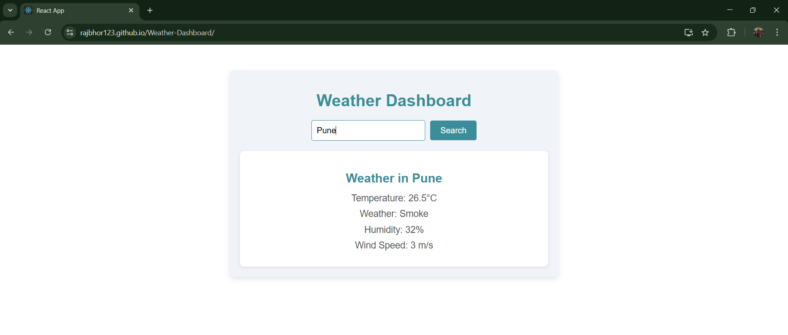

# Getting Started with React App

# ☁️ Weather Dashboard

## Overview
The **Weather Dashboard** is a user-friendly React application that allows users to search for and view real-time weather updates for any city worldwide. With a clean and attractive UI, this app provides essential weather details like temperature, humidity, wind speed, and weather conditions in a simple and easy-to-understand format.

## 🌐 Features
- ✨ **Real-Time Weather Data**: Fetches up-to-date weather details using the Weatherbit API.
- 🌇 **Search Any City**: Users can enter a city name to get the latest weather information.
- ⏳ **Loading Indicator**: Displays a loading message while fetching data.
- ⚠ **Error Handling**: Provides meaningful error messages for invalid city names or API issues.
- 🌍 **Default City (New York)**: Shows weather data for New York by default.
- 🌟 **Attractive UI**: Simple and responsive design for a seamless user experience.

## ♻ Tech Stack
- **Frontend**: React.js
- **Styling**: CSS
- **API**: [Weatherbit API](https://www.weatherbit.io/)

## 🛠 Installation & Setup
Follow these steps to run the Weather Dashboard locally:

1. **Clone the Repository**:
   ```sh
   git clone https://github.com/your-username/weather-dashboard.git
   cd weather-dashboard
   ```

2. **Install Dependencies**:
   ```sh
   npm install
   ```

3. **Replace API Key**:
   - Sign up on [Weatherbit](https://www.weatherbit.io/) to get an API key.
   - Open `Weather.js` and replace `API_KEY` with your own key.

4. **Run the Application**:
   ```sh
   npm start
   ```
   The app will open at `http://localhost:3000/`

## 📺 Preview & Screenshots

  Live Preview: [Weather Dashboard](https://rajbhor123.github.io/Weather-Dashboard/)

## 📺 Screenshots
### Home Page:



## ✨ Future Enhancements
- Add **5-day weather forecast**.
- Implement **geolocation-based weather**.
- Include **dark mode** for better UX.

## ✅ Contributing
Contributions are welcome! Feel free to fork the repository and submit a pull request.

## 📢 License
This project is open-source and available under the [MIT License](LICENSE).

---
Developed with ❤ by [Raj Bhor](https://github.com/RajBhor123)

